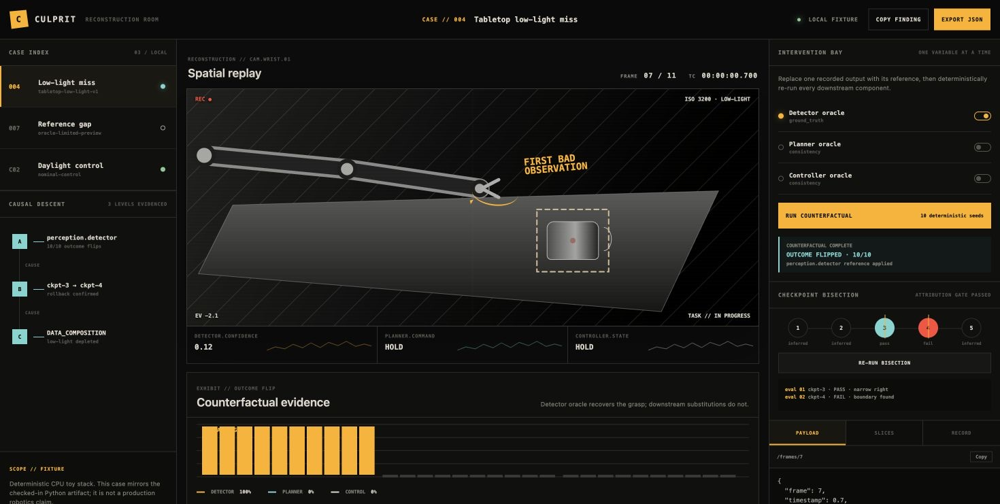

# CULPRIT

CULPRIT is a deterministic debugging harness for multi-model systems. It
answers three questions with re-execution evidence: which component caused the
failure, which checkpoint transition introduced it, and what changed in the
training data.

The source brief is copied to [`docs/BRIEF.md`](docs/BRIEF.md). This repository
ships a compact full-descent P0 reference implementation. It does not claim
production robotics or external-benchmark performance; see
[`LIMITS.md`](LIMITS.md).

## Product site and reconstruction workbench

The GitHub Pages surface is a complete product briefing rather than a redirect
to the generated report:

- [`docs/index.html`](docs/index.html) explains the problem, causal thesis,
  proof fixture, mechanism, architecture, and limits.
- [`docs/app/index.html`](docs/app/index.html) is a deterministic interactive
  reconstruction room with synchronized playback, timeline scrubbing,
  component interventions, outcome-flip trials, checkpoint bisection,
  training-slice audit, payload inspection, and finding export.
- [`docs/demo/index.html`](docs/demo/index.html) remains the report generated
  by the Python engine.
- [`docs/USER_JOURNEYS.md`](docs/USER_JOURNEYS.md) maps attributed and
  unattributed paths for incident response, robotics, model, and data owners.

The browser workbench uses embedded fixture data so it remains keyless and
works on static hosting. It does not pretend to run an external robot or agent.
Run `make demo` to regenerate the authoritative finding from the Python
implementation.

## Journey 0

```bash
git clone https://github.com/Aneesh-Pothuru/culprit
cd culprit
make demo
```

The demo needs no key, GPU, ROS install, or network. It investigates a
three-component `detector → planner → controller` tabletop stack with five
checkpoints. Checkpoint 4 drops the low-light training slice. The run:

1. ranks deviations and proves the detector by multi-seed counterfactual;
2. bisects the decisive frame and checkpoint 3 → 4 transition;
3. confirms rollback and audits the manifest/slice change;
4. renders one three-verdict report at
   [`docs/demo/index.html`](docs/demo/index.html).



The Makefile also executes the brief's live CPU command:

```bash
python -m pip install .
culprit investigate --live
```

“Live” means re-executing the local toy stack rather than replaying a stored
finding. It is still deterministic and keyless.

## Commands

```bash
make test
make lint
make reproduce-counterfactuals
make reproduce-benchmark

culprit bisect
culprit audit-data
```

`stack.yaml` and `registry.yaml` use JSON syntax, which is valid YAML and can
be parsed with the standard library. The vendored loopkit schema is in
`src/culprit/schemas/loopkit.py`.

## Evidence flow

```text
trace → actor-keyed timeline → deviation scan → counterfactual replay
                                              ↓
manifest diff ← data auditor ← checkpoint bisection + generated probes
                                              ↓
                                  JSON + static HTML finding
```
